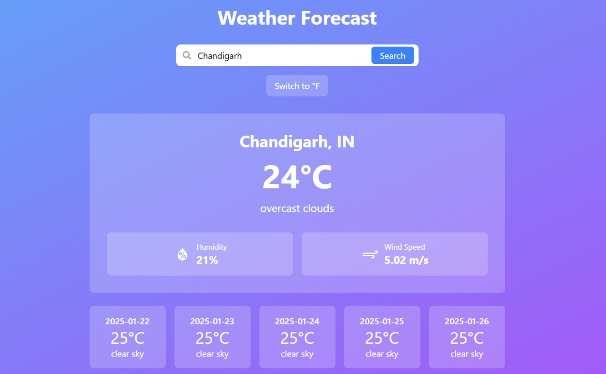

# Weather Dashboard


A modern React-based weather application that provides current weather conditions and 5-day forecast for any city, with automatic location detection.

## Features

- **Current Weather Display**: Shows temperature, humidity, wind speed, and weather conditions
- **5-Day Forecast**: Displays weather predictions for the next 5 days
- **Geolocation Support**: Automatically detects and shows weather for user's current location
- **City Search**: Search weather information for any city worldwide
- **Temperature Unit Toggle**: Switch between Celsius and Fahrenheit
- **Responsive Design**: Works seamlessly across desktop and mobile devices

## Technologies Used

- **React**: Frontend framework
- **Tailwind CSS**: Styling and responsive design
- **Axios**: API requests handling
- **OpenWeatherMap API**: Weather data source
- **React Icons**: Weather and UI icons
- **Browser Geolocation API**: User location detection

## Getting Started

1. Clone the repository
2. Install dependencies:
    ```bash
    npm install
    ```
3. Start the development server:
    ```bash
    npm start
    ```